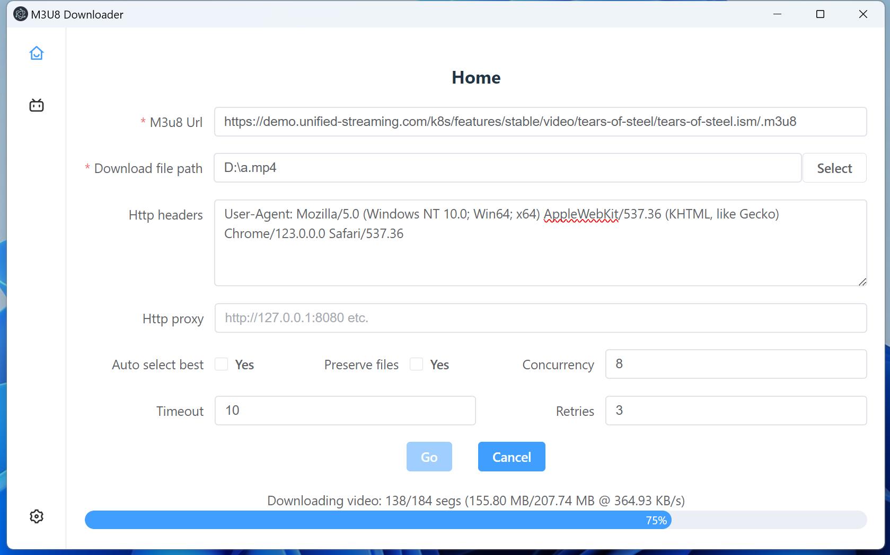
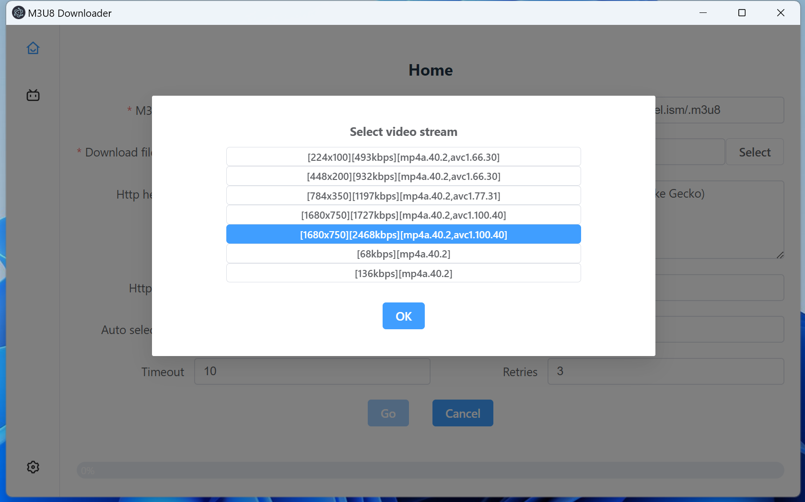

### M3U8 Downloader
Yet another m3u8 downloader built with vue3/vite, element-plus & electron.

### Features
- Video/Audio stream selection
- Concurrent download support
- Http headers customization support
- Http proxy support
- HLS `X-MAP` support
- HLS `AES-128` encryption support

#### Dependencies
- Vite 5+: Node 18+ is required, and CJS Node API is deprecated.
- Electron 28+: It enables ESM support.
- `patch-package` is used to workaround a `fluent-ffmpeg` path resolve bug.

#### Notes
- `NODE_ENV` is a node environment variable, see [here](https://nodejs.org/en/learn/getting-started/nodejs-the-difference-between-development-and-production).
- Vite has a similar but different `mode` concept, see [here](https://vitejs.dev/guide/env-and-mode.html#node-env-and-modes).
- In development environment:
  - ESM are requested and loaded directly in browsers, see [here](https://vitejs.dev/guide/features).
  - Vite dev server transform `*.vue`/`*.css` and other files to ESM(in memory) to be hosted, see [here](https://github.com/vitejs/vite/blob/main/packages/vite/src/node/server/middlewares/transform.ts).
  - Vite server and client communicate via websocket, a websocket connection can be found in devtools.
- In development environment, esbuild is used for:
  - pre-bundle dependencies to convert them to ESM.
  - transpile typescript to javascript, so that HMR can reflect in the browser.
- In production environment, rollup is used for bundling for its flexibility. see [here](https://vitejs.dev/guide/why.html#why-not-bundle-with-esbuild).
- When using Github Actions, electron-builder auto detects CI environment via `GITHUB_ACTIONS` environment variable (via `is-ci` package).
